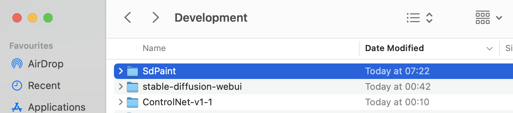
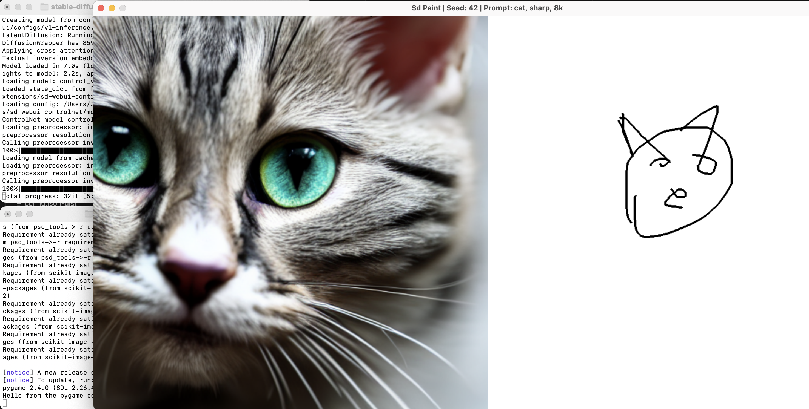

# Installation

These instructions are for getting started with SDPaint on a MacOS machine. Assuming you started from no experience with SD, and some experience with GitHub. Also assuming that you don't already have Homebrew with the correct version of git and python installed

```
PLEASE NOTE: These instructions have only been tested to be working on a MacBook Pro with Apple M2 Pro chip.
```

## Install dependencies

### Install Homebrew

See www.brew.sh or just run the below command in a new Terminal window.

```
/bin/bash -c "$(curl -fsSL https://raw.githubusercontent.com/Homebrew/install/HEAD/install.sh)"
```

### Add Brew to Profile

This will allow you to type `brew` commands

```
(echo; echo 'eval "$(/opt/homebrew/bin/brew shellenv)"') >> ~/.zprofile
eval "$(/opt/homebrew/bin/brew shellenv)"
```

### Install Homebrew packages

```
brew install cmake protobuf rust python@3.10 git git-lfs wget cairo python-tk@3.10
```

### Add Python to Profile

This will allow you to type `python` and `pip` commands

```
echo -n 'export PATH="$(brew --prefix)/opt/python@3.10/libexec/bin:$PATH"' >> ~/.zshrc
source ~/.zshrc
```

## Clone These repos:

### 1.) This Tool

```
git clone https://github.com/houseofsecrets/SdPaint
```

### 2.) The AI models

```
git lfs install
git clone https://huggingface.co/lllyasviel/ControlNet-v1-1
```

- Note: The large files in the huggingface repo requires running `git lfs install` before cloning. Details at https://git-lfs.com/
- The `.pth` files in this directory should each be ~1.4GB after the `git clone` is done, total ~18GB. If they are only ~2KB in file size, then `git lfs install` needs to be ran before cloning again. Please be patient this step can take a while.

### 3.) stable-diffusion-webui

```
git clone https://github.com/AUTOMATIC1111/stable-diffusion-webui
```

## Setup

You should now have the following folders:



Download `https://huggingface.co/runwayml/stable-diffusion-v1-5/resolve/main/v1-5-pruned-emaonly.ckpt` file which is the SD v1.5 pruned EMA only checkpoint. You can download other SD versions checkpoint at this point as well.
Put all SD checkpoint files you've downloaded into the `stable-diffusion-webui/models/Stable-diffusion` folder

Run the Web UI with a new Terminal window

```
cd stable-diffusion-webui
./webui.sh
```

Note: You will have to wait for bunch of python dependencies to install here and more repos cloned, and some json / txt files downloaded, please be patient. The first time run will also install SD so you can use this independently if you wish.

The Web UI is now running locally. Once you see a line starting with "Startup time:" in the terminal it is ready to be used. In a browser, visit the default address at

```
http://127.0.0.1:7860
```


In the Web UI, navigate to the "Extensions Tab" and go to the "Install from URL" tab. Then add the extension from

```
https://github.com/Mikubill/sd-webui-controlnet
```

Nothing will seem to happen, but if you go back to the "Installed" tab, it should say "processing".


Press the "Check for Updates" button, just in case. Then press the "Apply and Restart UI".


Note: Sometimes "Apply and Restart UI" kills Web UI and you may have to re-run `./webui.sh` from the Terminal again to get it going

Once reloaded, navigate to the Settings of the Web UI. Open the ControlNet settings and look for "Allow other script to control this extension" and enable it. Apply settings.


Close the Web UI and the terminal window running the process. For extra certainty, restart your computer, but it should not be needed unless some background process is stuck or you are unsure how to reload it.

Move the .pth and their matching .yaml files from the AI models folder
`ControlNet-v1-1`
To the folder at
`stable-diffusion-webui\extensions\sd-webui-controlnet\models`
Overwrite any existing files in the destination folder.


Open the `stable-diffusion-webui\webui-macos-env.sh` file using a text editor
Change the line by adding `--api` parameter by changing it from

```
export COMMANDLINE_ARGS="--skip-torch-cuda-test --upcast-sampling --no-half-vae --use-cpu interrogate"
```

Into

```
export COMMANDLINE_ARGS="--api --skip-torch-cuda-test --upcast-sampling --no-half-vae --use-cpu interrogate"
```

Save the file.

## Usage

Open one new Terminal and launch the Web UI with the API feature enabled

```
cd stable-diffusion-webui
./webui.sh
```

Note: You need to wait until the "Startup time:" is shown in the terminal before it is ready to be used.

Open another new Terminal window (in addition to Web UI terminal) and launch SDPaint

```
cd SdPaint
./start.sh
```

This will create a Python venv and install a few packages the very first time, please be patient. Then it will open the canvas.



With the basics launched and ready, you should have the two terminal windows running the processes and the one SD Paint program window.
You can safely minimize the terminal windows, but remember to close them when you are done to free up system memory.

## Configuration

Configuration is OS agnostic. See the [README](README.md) for configuration instructions.

### Prompt configuration

To configure both the prompt and negative prompt open the `SdPaint\configs\controlnet.json` file using a text editor and modify the `prompt` and `negative_prompt` parameters.
Save the file and restart SdPaint after you make any changes.

## Known Issues

- SdPaint seems to crash when pressing `p` key on canvas, so editing of prompts can only be done via `SdPaint\configs\controlnet.json` file as per above instruction.
- Using "Apply and Restart UI" in Web UI will sometimes terminate Web UI entirely so you may have to re-run `./webui.sh` from the Terminal again to get it going
- Web UI extension `sd-webui-controlnet` can end up with a corrupt model cache. You will see an error similar to one below in the Web UI terminal when you are trying to render an image in SdPaint. To resolve this you will need to stop Web UI, delete `stable-diffusion-webui/extensions/sd-webui-controlnet` folder and re-install `sd-webui-controlnet` extension as per earlier instructions. Take care backup your .pth and their matching .yaml files from the `stable-diffusion-webui\extensions\sd-webui-controlnet\models` folder so you don't have to redownload those again.

```
File "stable-diffusion-webui/extensions/sd-webui-controlnet/scripts/controlnet.py", line 689, in load_control_model
    if model in Script.model_cache:
TypeError: unhashable type: 'list'
```

### Warnings To Ignore

When running `./webui.sh` you may see some errors such as ones listed below in the terminal. Please ignore those for the time being.

```
No module 'xformers'. Proceeding without it.
Warning: caught exception 'Torch not compiled with CUDA enabled', memory monitor disabled
```
