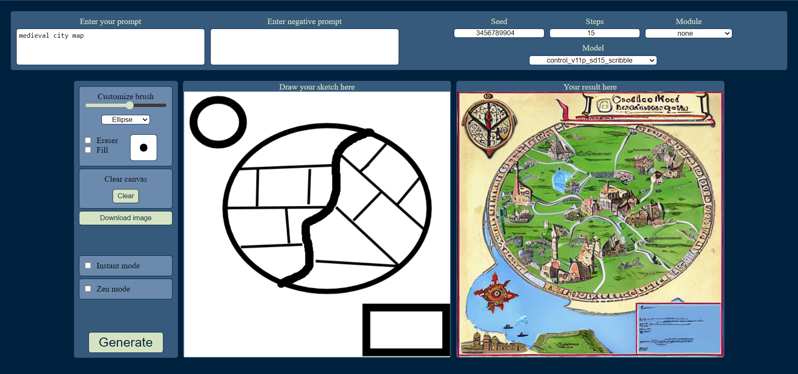

# Installation

These instructions are for getting started with SDPaint on a Windows machine. Assuming you started from no experience with SD, and some experience with GitHub.

## Clone These repos:

### 1.) This Tool

`git clone https://github.com/houseofsecrets/SdPaint`

### 2.) The AI models

```
git lfs install
git clone https://huggingface.co/lllyasviel/ControlNet-v1-1
```

- Note: The large files in the huggingface repo requires running `git lfs install` before cloning. Details at https://git-lfs.com/
- The `.pth` files in this directory should each be ~1.4GB after the `git clone` is done. If they are only ~2KB in file size, then `git lfs install` needs to be ran before cloneing again.

### 3.) stable-diffusion-webui

`git clone https://github.com/AUTOMATIC1111/stable-diffusion-webui`

- Follow the [instructions](https://github.com/AUTOMATIC1111/stable-diffusion-webui#installation-and-running) to install the Web UI for Windows. It can be used independently, and will install Stable Diffusion.

## Setup

You should now have the following folders:


Run the Web UI by launching
`stable-diffusion-webui\webui-user.bat`

The first time will also install SD so you can use this independently if you wish.

The Web UI is now running locally. In a browser, visit the default address at
`http://127.0.0.1:7860`


In the Web UI, navigate to the "Extensions Tab" and go to the "Install from URL" tab. Then add the extension from
`https://github.com/Mikubill/sd-webui-controlnet`

Nothing will seem to happen, but if you go back to the "Installed" tab, it should say "processing".


Press the "Check for Updates" button, just in case. Then press the "Apply and Restart UI".


Once reloaded, navigate to the Settings of the Web UI. Open the ControlNet settings and look for "Allow other script to control this extension" and enable it. Apply settings.


Close the Web UI and the terminal window running the process. For extra certainty, restart your computer, but it should not be needed unless some background process is stuck or you are unsure how to reload it.

Move the .pth files from the AI models folder
`ControlNet-v1-1`
To the folder at
`stable-diffusion-webui\extensions\sd-webui-controlnet\models`

Also ensure that each .pth file has a matching .yaml file (the names must be the same except for the extension)


Create a copy of the launch file
`stable-diffusion-webui\webui-user.bat`
and name it
`webui-user-api.bat`

Edit your new file in a text editor (notepad is fine)

Change the line
`set COMMANDLINE_ARGS=`
to read:
`set COMMANDLINE_ARGS= --api`


## Usage

Launch the Web UI with your API enabled launch file
`stable-diffusion-webui\webui-user-api.bat`

Note: You need to wait until the "Startup time:" is shown in the terminal before it is ready to be used.

Launch SDPaint from the file
`SdPaint\Start.bat`
This will create a venv and install a few packages the very first time. Then it will open the canvas.


With the basics launched and ready, you should have the two terminal windows running the processes and the one SD Paint program window.
You can safely minimize the terminal windows, but remember to close them when you are done to free up system memory.

### `Web interface`



Alternatively, you can use web interface. Just run `SdPaint\StartWeb.bat`. After creating virtual environment and installing packages it will open interface in your default browser. More in [this instruction](README_Web.md)

## Configuration

Configuration is OS agnostic. See the [README](README.md) for configuration instructions.
