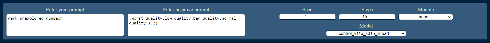
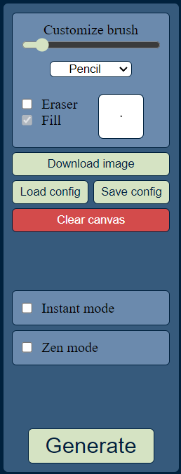
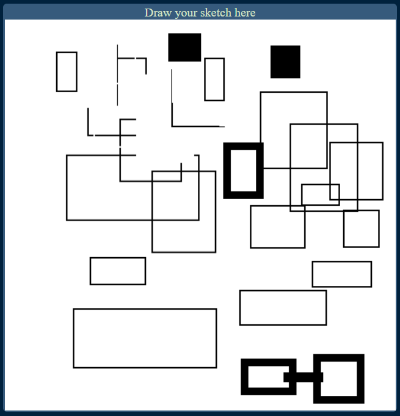
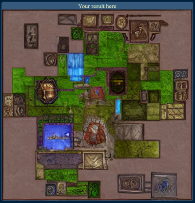
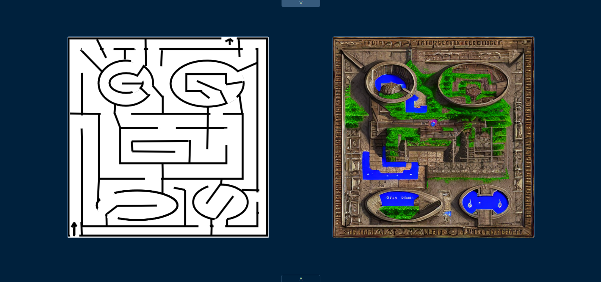

# SdPaint

A Web script that lets you paint on a canvas and sends that image to the automatic1111 API and updates the result frame when the image is generated.

## Controls

| Key                                     | Control                                             |
| --------------------------------------- | --------------------------------------------------- |
| `Escape`                                | Escape from image viewer or switch off zen mode     |
| `Enter`                                 | Request image rendering                             |
| `Equal`                                 | Increase brush size                                 |
| `Minus`                                 | Decrease brush size                                 |
| `Delete`                                | Clear painting canvas                               |
| `d`                                     | Download result image (if any) from browser         |
| `e`                                     | Set brush type to `ellipse`                         |
| `l`                                     | Set brush type to `line`                            |
| `p`                                     | Set brush type to `pencil`                          |
| `r`                                     | Set brush type to `rectangle`                       |
| `Ctrl` + `e`                            | Switch eraser brush mode                            |
| `f`                                     | Switch fill brush mode                              |
| `i`                                     | Switch instant generation mode                      |
| `Ctrl` + `r`                            | Reset interface (standard browser page reload)      |
| `s`                                     | Increase seed by 1                                  |
| `Shift` + `s`                           | Decrease seed by 1                                  |
| `v`                                     | Switch image viewer mode (if there is result image) |
| `z`                                     | Switch zen mode                                     |
| `Ctrl` + `z`                            | Undo canvas action                                  |
| `Shift` + `y` or `Ctrl` + `Shift` + `z` | Redo an undone canvas action                        |

_Note_ : most widgets can handle standard browser hotkeys such as `Ctrl` + `a` in text input to select all it's content

## Installation

Windows: [Link to step-by-step Windows installation instructions with screenshots](INSTALL_Windows.md)

macOS: [Link to step-by-step MacOS installation instructions with screenshots](INSTALL_MacOS.md)

Linux: To Do

TLDR; [Web UI](https://github.com/AUTOMATIC1111/stable-diffusion-webui) with
the [ControlNet](https://github.com/Mikubill/sd-webui-controlnet) extension, API mode enabled in settings, and
the [AI Models](https://huggingface.co/lllyasviel/ControlNet-v1-1)

## Interface

Web interface consists of `config form`, `tools section`, `painting canvas` and `result area`

### `Config form`

This is partial representation of `controlnet.json` file. It consists of:

- `prompt` input
- `negative prompt` input
- `seed` input
- `steps` input
- `module` selector
- `model` selector

All this data is sent to ControlNet API when you request image generation.

### `Tools section`

This is main control panel of this app. Here are:

- `Brush customizer`. It handles behavior of drawing brush. Here you can change width, switch eraser, toggle shape modes and their filling. There is four shape modes: `pencil`, `line`, `ellipse` and `rectangle`.
- `Clear` button. Resets `painting canvas`
- `Download` button. Downloads result image (if any)
- `Instant mode` button. Switches instant mode (requests image redraw just when you stroke)
- `Zen mode` button. Enters simplified interface mode
- `Generate` button. Triggers ControlNet API image generation.

### `Painting canvas`

This is area for drawing. If instant mode enabled, after each stroke image will be requested.

### `Result area`

There is a place for ControlNet generations. If in process, progressbar will appear.

### Zen mode

Zen mode is more simplified interface mode. Only `painting canvas` and `result area` are present. `ControlNet form` is hidden. `Tools section` is minified and hidden. By clicking arrows you can invoke them.

## Contributing

Pull requests are welcome. Development brunch is https://github.com/Pythongor/SdPaint/tree/web-view.

To run in development mode first you need to install `npm`. If you're done with it run `StartWeb.bat` or `start-web.sh` depending on your OS. There can be alert, ignore it. In separated terminal run `cd scripts\views\WebView; npm start` from project root. Your default browser will open http://localhost:3000/ with app. Now all your changes in `scripts\views\WebView\src` will renew page.

## License

[MIT](https://choosealicense.com/licenses/mit/)
